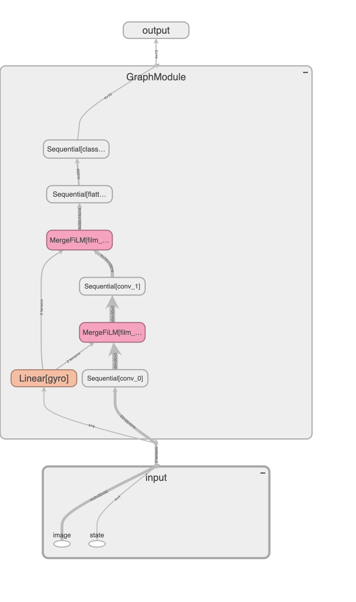

# TorchArc


Build PyTorch models by specifying architectures.

## Installation

Bring [your own PyTorch](https://docs.astral.sh/uv/guides/integration/pytorch/), then install this package:

```bash
pip install torcharc
```

## Usage

1. specify model architecture in a YAML spec file, e.g. at `spec_filepath = "./example/spec/basic/mlp.yaml"`
2. `import torcharc`
3. (optional) if you have custom torch.nn.Module, e.g. `MyModule`, register it with `torcharc.register_nn(MyModule)`
4. build with: `model = torcharc.build(spec_filepath)`

The returned model is a PyTorch `nn.Module`, fully-compatible with `torch.compile`, and mostly compatible with PyTorch JIT script and trace.

See more examples below, then see how it work at the end.

---

### Example: build model from spec file

```python
from pathlib import Path

import torch
import yaml

import torcharc


filepath = Path(".") / "torcharc" / "example" / "spec" / "basic" / "mlp.yaml"

# The following are equivalent:

# 1. build from YAML spec file
model = torcharc.build(filepath)

# 2. build from dictionary
with filepath.open("r") as f:
    spec_dict = yaml.safe_load(f)
model = torcharc.build(spec_dict)

# 3. use the underlying Pydantic validator to build the model
spec = torcharc.Spec(**spec_dict)
model = spec.build()
```

---

### Example: basic MLP

<details><summary>spec file</summary>

File: [torcharc/example/spec/basic/mlp.yaml](torcharc/example/spec/basic/mlp.yaml)

```yaml
modules:
  mlp:
    Sequential:
      - Linear:
          in_features: 128
          out_features: 64
      - ReLU:
      - Linear:
          in_features: 64
          out_features: 10

graph:
  input: x
  modules:
    mlp: [x]
  output: mlp
```

</details>

```python
model = torcharc.build(torcharc.SPEC_DIR / "basic" / "mlp.yaml")
assert isinstance(model, torch.nn.Module)

# Run the model and check the output shape
x = torch.randn(4, 128)
y = model(x)
assert y.shape == (4, 10)

# Test compatibility with compile, script and trace
compiled_model = torch.compile(model)
assert compiled_model(x).shape == y.shape
scripted_model = torch.jit.script(model)
assert scripted_model(x).shape == y.shape
traced_model = torch.jit.trace(model, (x))
assert traced_model(x).shape == y.shape

model
```

<details><summary>model</summary>

```
GraphModule(
  (mlp): Sequential(
    (0): Linear(in_features=128, out_features=64, bias=True)
    (1): ReLU()
    (2): Linear(in_features=64, out_features=10, bias=True)
  )
)
```


</details>

---

### Example: MLP (Lazy)

<details><summary>spec file</summary>

File: [torcharc/example/spec/basic/mlp_lazy.yaml](torcharc/example/spec/basic/mlp_lazy.yaml)

```yaml
# NOTE lazy modules is recommended for ease https://pytorch.org/docs/stable/generated/torch.nn.LazyLinear.html
modules:
  mlp:
    Sequential:
      - LazyLinear:
          out_features: 64
      - ReLU:
      - LazyLinear:
          out_features: 10

graph:
  input: x
  modules:
    mlp: [x]
  output: mlp
```

</details>

```python
# PyTorch Lazy layers will infer the input size from the first forward pass. This is recommended as it greatly simplifies the model definition.
model = torcharc.build(torcharc.SPEC_DIR / "basic" / "mlp_lazy.yaml")
model  # shows LazyLinear before first forward pass
```

<details><summary>model (before forward pass)</summary>

```
GraphModule(
  (mlp): Sequential(
    (0): LazyLinear(in_features=0, out_features=64, bias=True)
    (1): ReLU()
    (2): LazyLinear(in_features=0, out_features=10, bias=True)
  )
)
```

</details>

```python
# Run the model and check the output shape
x = torch.randn(4, 128)
y = model(x)
assert y.shape == (4, 10)

# Because it is lazy - wait till first forward pass to run compile, script or trace
compiled_model = torch.compile(model)

model  # shows Linear after first forward pass
```

<details><summary>model (after forward pass)</summary>

```
GraphModule(
  (mlp): Sequential(
    (0): Linear(in_features=128, out_features=64, bias=True)
    (1): ReLU()
    (2): Linear(in_features=64, out_features=10, bias=True)
  )
)
```


</details>

---

### Example: MNIST conv

<details><summary>spec file</summary>

File: [torcharc/example/spec/mnist/conv.yaml](torcharc/example/spec/mnist/conv.yaml)

```yaml
# MNIST Conv2d model example from PyTorch https://github.com/pytorch/examples/blob/main/mnist/main.py
modules:
  conv:
    Sequential:
      - LazyConv2d:
          out_channels: 32
          kernel_size: 3
      - ReLU:
      - LazyConv2d:
          out_channels: 64
          kernel_size: 3
      - ReLU:
      - MaxPool2d:
          kernel_size: 2
      - Dropout:
          p: 0.25
      - Flatten:
      - LazyLinear:
          out_features: 128
      - ReLU:
      - Dropout:
          p: 0.5
      - LazyLinear:
          out_features: 10
      - LogSoftmax:
          dim: 1

graph:
  input: image
  modules:
    conv: [image]
  output: conv
```

</details>

```python
model = torcharc.build(torcharc.SPEC_DIR / "mnist" / "conv.yaml")

# Run the model and check the output shape
x = torch.randn(4, 1, 28, 28)
y = model(x)
assert y.shape == (4, 10)

model
```

<details><summary>model</summary>

```
GraphModule(
  (conv): Sequential(
    (0): Conv2d(1, 32, kernel_size=(3, 3), stride=(1, 1))
    (1): ReLU()
    (2): Conv2d(32, 64, kernel_size=(3, 3), stride=(1, 1))
    (3): ReLU()
    (4): MaxPool2d(kernel_size=2, stride=2, padding=0, dilation=1, ceil_mode=False)
    (5): Dropout(p=0.25, inplace=False)
    (6): Flatten(start_dim=1, end_dim=-1)
    (7): Linear(in_features=9216, out_features=128, bias=True)
    (8): ReLU()
    (9): Dropout(p=0.5, inplace=False)
    (10): Linear(in_features=128, out_features=10, bias=True)
    (11): LogSoftmax(dim=1)
  )
)
```


</details>

---

### Example: Reuse syntax: Stereo Conv

<details><summary>spec file</summary>

File: [torcharc/example/spec/basic/stereo_conv_reuse.yaml](torcharc/example/spec/basic/stereo_conv_reuse.yaml)

```yaml
# stereoscopic vision conv with shared (reused) conv
modules:
  # single conv shared for left and right
  conv:
    Sequential:
      - LazyConv2d:
          out_channels: 32
          kernel_size: 3
      - ReLU:
      - LazyConv2d:
          out_channels: 64
          kernel_size: 3
      - ReLU:
      - MaxPool2d:
          kernel_size: 2
      - Dropout:
          p: 0.25
      - Flatten:

  # separate identical mlp for left and right for processing
  left_mlp: &left_mlp
    Sequential:
      - LazyLinear:
          out_features: 256
      - ReLU:
      - LazyLinear:
          out_features: 10
      - ReLU:
  right_mlp:
    <<: *left_mlp

graph:
  input: [left_image, right_image]
  modules:
    # reuse syntax: <module>~<suffix>
    conv~left: [left_image]
    conv~right: [right_image]
    left_mlp: [conv~left]
    right_mlp: [conv~right]
  output: [left_mlp, right_mlp]
```

</details>

```python
# To use the same module for many passes, specify with the reuse syntax in graph spec: <module>~<suffix>.
# E.g. stereoscopic model with `left` and `right` inputs over a shared `conv` module: `conv~left` and `conv~right`.
model = torcharc.build(torcharc.SPEC_DIR / "basic" / "stereo_conv_reuse.yaml")

# Run the model and check the output shape
left_image = right_image = torch.randn(4, 3, 32, 32)
left, right = model(left_image=left_image, right_image=right_image)
assert left.shape == (4, 10)
assert right.shape == (4, 10)

model
```

<details><summary>model</summary>

```
GraphModule(
  (conv): Sequential(
    (0): Conv2d(3, 32, kernel_size=(3, 3), stride=(1, 1))
    (1): ReLU()
    (2): Conv2d(32, 64, kernel_size=(3, 3), stride=(1, 1))
    (3): ReLU()
    (4): MaxPool2d(kernel_size=2, stride=2, padding=0, dilation=1, ceil_mode=False)
    (5): Dropout(p=0.25, inplace=False)
    (6): Flatten(start_dim=1, end_dim=-1)
  )
  (left_mlp): Sequential(
    (0): Linear(in_features=12544, out_features=256, bias=True)
    (1): ReLU()
    (2): Linear(in_features=256, out_features=10, bias=True)
    (3): ReLU()
  )
  (right_mlp): Sequential(
    (0): Linear(in_features=12544, out_features=256, bias=True)
    (1): ReLU()
    (2): Linear(in_features=256, out_features=10, bias=True)
    (3): ReLU()
  )
)
```


</details>

---

### Example: transformer

<details><summary>spec file</summary>

File: [torcharc/example/spec/transformer/transformer.yaml](torcharc/example/spec/transformer/transformer.yaml)

```yaml
modules:
  src_embed:
    LazyLinear:
      out_features: &embed_dim 128
  tgt_embed:
    LazyLinear:
      out_features: *embed_dim
  transformer:
    Transformer:
      d_model: *embed_dim
      nhead: 8
      num_encoder_layers: 2
      num_decoder_layers: 2
      dim_feedforward: 1024
      dropout: 0.1
      batch_first: true
  mlp:
    LazyLinear:
      out_features: 10

graph:
  input: [src_x, tgt_x]
  modules:
    src_embed: [src_x]
    tgt_embed: [tgt_x]
    transformer:
      src: src_embed
      tgt: tgt_embed
    mlp: [transformer]
  output: mlp
```

</details>

```python
model = torcharc.build(torcharc.SPEC_DIR / "transformer" / "transformer.yaml")

# Run the model and check the output shape
src_x = torch.randn(4, 10, 64)
tgt_x = torch.randn(4, 20, 64)
y = model(src_x=src_x, tgt_x=tgt_x)
assert y.shape == (4, 20, 10)

model
```

<details><summary>model</summary>

```
GraphModule(
  (src_embed): Linear(in_features=64, out_features=128, bias=True)
  (tgt_embed): Linear(in_features=64, out_features=128, bias=True)
  (transformer): Transformer(
    (encoder): TransformerEncoder(
      (layers): ModuleList(
        (0-1): 2 x TransformerEncoderLayer(
          (self_attn): MultiheadAttention(
            (out_proj): NonDynamicallyQuantizableLinear(in_features=128, out_features=128, bias=True)
          )
          (linear1): Linear(in_features=128, out_features=1024, bias=True)
          (dropout): Dropout(p=0.1, inplace=False)
          (linear2): Linear(in_features=1024, out_features=128, bias=True)
          (norm1): LayerNorm((128,), eps=1e-05, elementwise_affine=True)
          (norm2): LayerNorm((128,), eps=1e-05, elementwise_affine=True)
          (dropout1): Dropout(p=0.1, inplace=False)
          (dropout2): Dropout(p=0.1, inplace=False)
        )
      )
      (norm): LayerNorm((128,), eps=1e-05, elementwise_affine=True)
    )
    (decoder): TransformerDecoder(
      (layers): ModuleList(
        (0-1): 2 x TransformerDecoderLayer(
          (self_attn): MultiheadAttention(
...
      (norm): LayerNorm((128,), eps=1e-05, elementwise_affine=True)
    )
  )
  (mlp): Linear(in_features=128, out_features=10, bias=True)
)
```

</details>

---

### Example: Get modules: Attention

> See more in [torcharc/module/get.py](torcharc/module/get.py)

<details><summary>spec file</summary>

File: [torcharc/example/spec/transformer/attn.yaml](torcharc/example/spec/transformer/attn.yaml)

```yaml
modules:
  src_embed:
    LazyLinear:
      out_features: &embed_dim 64
  tgt_embed:
    LazyLinear:
      out_features: *embed_dim
  attn:
    MultiheadAttention:
      embed_dim: *embed_dim
      num_heads: 4
      batch_first: True
  attn_output:
    # attn output is tuple; get the first element to pass to mlp
    Get:
      key: 0
  mlp:
    LazyLinear:
      out_features: 10

graph:
  input: [src_x, tgt_x]
  modules:
    src_embed: [src_x]
    tgt_embed: [tgt_x]
    attn:
      query: src_embed
      key: tgt_embed
      value: tgt_embed
    attn_output: [attn]
    mlp: [attn_output]
  output: mlp
```

</details>

```python
# Some cases need "Get" module, e.g. get first output from MultiheadAttention
model = torcharc.build(torcharc.SPEC_DIR / "transformer" / "attn.yaml")

# Run the model and check the output shape
src_x = torch.rand(4, 10, 64)  # (batch_size, seq_len, embed_dim)
tgt_x = torch.rand(4, 20, 64)  # (batch_size, seq_len, embed_dim)
# Get module gets the first output from MultiheadAttention
y = model(src_x=src_x, tgt_x=tgt_x)
assert y.shape == (4, 10, 10)

model
```

<details><summary>model</summary>

```
GraphModule(
  (src_embed): Linear(in_features=64, out_features=64, bias=True)
  (tgt_embed): Linear(in_features=64, out_features=64, bias=True)
  (attn): MultiheadAttention(
    (out_proj): NonDynamicallyQuantizableLinear(in_features=64, out_features=64, bias=True)
  )
  (attn_output): Get()
  (mlp): Linear(in_features=64, out_features=10, bias=True)
)
```


</details>

---

### Example: Merge modules: DLRM

> See more in [torcharc/module/merge.py](torcharc/module/merge.py)

<details><summary>spec file</summary>

File: [torcharc/example/spec/advanced/dlrm_sum.yaml](torcharc/example/spec/advanced/dlrm_sum.yaml)

```yaml
# basic DLRM architecture ref: https://github.com/facebookresearch/dlrm and ref: https://catalog.ngc.nvidia.com/orgs/nvidia/resources/dlrm_for_pytorch
modules:
  # NOTE dense mlp and each embedding needs to be the same size
  dense_mlp:
    Sequential:
      - LazyLinear:
          out_features: 512
      - ReLU:
      - LazyLinear:
          out_features: 256
      - ReLU:
      - LazyLinear:
          out_features: &feat_dim 128
      - ReLU:

  cat_embed_0:
    Embedding:
      num_embeddings: 1000
      embedding_dim: *feat_dim
  cat_embed_1:
    Embedding:
      num_embeddings: 1000
      embedding_dim: *feat_dim
  cat_embed_2:
    Embedding:
      num_embeddings: 1000
      embedding_dim: *feat_dim

  # pairwise interactions (original mentions sum, pairwise dot, cat) - but modern day this can be anything, e.g. self-attention
  merge:
    MergeSum:

  # final classifier for probability of click
  classifier:
    Sequential:
      - LazyLinear:
          out_features: 256
      - ReLU:
      - LazyLinear:
          out_features: 256
      - ReLU:
      - LazyLinear:
          out_features: 1
      - Sigmoid:

graph:
  input: [dense, cat_0, cat_1, cat_2]
  modules:
    dense_mlp: [dense]
    cat_embed_0: [cat_0]
    cat_embed_1: [cat_1]
    cat_embed_2: [cat_2]
    merge: [[dense_mlp, cat_embed_0, cat_embed_1, cat_embed_2]]
    classifier: [merge]
  output: classifier
```

</details>

```python
# For more complex models, merge modules can be used to combine multiple inputs into a single output.
model = torcharc.build(torcharc.SPEC_DIR / "advanced" / "dlrm_sum.yaml")

# Run the model and check the output shape
dense = torch.randn(4, 256)
cat_0 = torch.randint(0, 1000, (4,))
cat_1 = torch.randint(0, 1000, (4,))
cat_2 = torch.randint(0, 1000, (4,))
y = model(dense, cat_0, cat_1, cat_2)
assert y.shape == (4, 1)

model
```

<details><summary>model</summary>

```
GraphModule(
  (dense_mlp): Sequential(
    (0): Linear(in_features=256, out_features=512, bias=True)
    (1): ReLU()
    (2): Linear(in_features=512, out_features=256, bias=True)
    (3): ReLU()
    (4): Linear(in_features=256, out_features=128, bias=True)
    (5): ReLU()
  )
  (cat_embed_0): Embedding(1000, 128)
  (cat_embed_1): Embedding(1000, 128)
  (cat_embed_2): Embedding(1000, 128)
  (merge): MergeSum()
  (classifier): Sequential(
    (0): Linear(in_features=128, out_features=256, bias=True)
    (1): ReLU()
    (2): Linear(in_features=256, out_features=256, bias=True)
    (3): ReLU()
    (4): Linear(in_features=256, out_features=1, bias=True)
    (5): Sigmoid()
  )
)
```


</details>

---

### Example: Merge modules: FiLM

<details><summary>spec file</summary>

File: [torcharc/example/spec/merge/film.yaml](torcharc/example/spec/merge/film.yaml)

```yaml
# FiLM https://distill.pub/2018/feature-wise-transformations/
modules:
  feat:
    LazyLinear:
      out_features: &feat_dim 10
  cond:
    LazyLinear:
      out_features: &cond_dim 4
  merge_0_1:
    MergeFiLM:
      feature_dim: *feat_dim
      conditioner_dim: *cond_dim
  tail:
    Linear:
      in_features: *feat_dim
      out_features: 1

graph:
  input: [x_0, x_1]
  modules:
    feat: [x_0]
    cond: [x_1]
    merge_0_1:
      feature: feat
      conditioner: cond
    tail: [merge_0_1]
  output: tail
```

</details>

```python
# Custom MergeFiLM module for Feature-wise Linear Modulation https://distill.pub/2018/feature-wise-transformations/
model = torcharc.build(torcharc.SPEC_DIR / "advanced" / "film_image_state.yaml")

# Run the model and check the output shape
image = torch.randn(4, 3, 32, 32)
state = torch.randn(4, 4)
y = model(image=image, state=state)
assert y.shape == (4, 10)

model
```

<details><summary>model</summary>

```
GraphModule(
  (conv_0): Sequential(
    (0): Conv2d(3, 64, kernel_size=(3, 3), stride=(1, 1))
    (1): ReLU()
  )
  (gyro): Linear(in_features=4, out_features=10, bias=True)
  (film_0): MergeFiLM(
    (gamma): Linear(in_features=10, out_features=64, bias=True)
    (beta): Linear(in_features=10, out_features=64, bias=True)
  )
  (conv_1): Sequential(
    (0): Conv2d(64, 32, kernel_size=(3, 3), stride=(1, 1))
    (1): ReLU()
    (2): MaxPool2d(kernel_size=2, stride=2, padding=0, dilation=1, ceil_mode=False)
    (3): Dropout(p=0.25, inplace=False)
  )
  (film_1): MergeFiLM(
    (gamma): Linear(in_features=10, out_features=32, bias=True)
    (beta): Linear(in_features=10, out_features=32, bias=True)
  )
  (flatten): Sequential(
    (0): Flatten(start_dim=1, end_dim=-1)
    (1): Linear(in_features=6272, out_features=256, bias=True)
  )
  (classifier): Sequential(
...
    (1): ReLU()
    (2): Linear(in_features=64, out_features=10, bias=True)
    (3): LogSoftmax(dim=1)
  )
)
```



</details>

---

### Example: Fork modules: Chunk

> See more in [torcharc/module/fork.py](torcharc/module/fork.py)

<details><summary>spec file</summary>

File: [torcharc/example/spec/fork/chunk.yaml](torcharc/example/spec/fork/chunk.yaml)

```yaml
modules:
  head:
    Linear:
      in_features: 32
      out_features: 10
  fork_0_1:
    ForkChunk:
      chunks: 2
  tail_0:
    Get:
      key: 0
  tail_1:
    Get:
      key: 1

graph:
  input: x
  modules:
    head: [x]
    fork_0_1: [head]
    tail_0: [fork_0_1]
    tail_1: [fork_0_1]
  output: [tail_0, tail_1]
```

</details>

```python
# Fork module can be used to split the input into multiple outputs.
model = torcharc.build(torcharc.SPEC_DIR / "fork" / "chunk.yaml")

# Run the model and check the output shape
x = torch.randn(4, 32)
y = model(x)
assert len(y) == 2  # tail_0, tail_1

model
```

<details><summary>model</summary>

```
GraphModule(
  (head): Linear(in_features=32, out_features=10, bias=True)
  (fork_0_1): ForkChunk()
  (tail_0): Get()
  (tail_1): Get()
)
```


</details>

---

### Example: reduction op functional modules: Reduce

> See more in [torcharc/module/fn.py](torcharc/module/fn.py)

<details><summary>spec file</summary>

File: [torcharc/example/spec/fn/reduce_mean.yaml](torcharc/example/spec/fn/reduce_mean.yaml)

```yaml
modules:
  text_token_embed:
    Embedding:
      num_embeddings: 10000
      embedding_dim: &embed_dim 128
  text_tfmr:
    Transformer:
      d_model: *embed_dim
      nhead: 8
      num_encoder_layers: 2
      num_decoder_layers: 2
      dropout: 0.1
      batch_first: true
  text_embed:
    # sentence embedding has shape [batch_size, seq_len, embed_dim],
    # one way to reduce it to a single sentence embedding is by pooling, e.g. reduce with mean over seq
    Reduce:
      name: mean
      dim: 1

graph:
  input: [text]
  modules:
    text_token_embed: [text]
    text_tfmr:
      src: text_token_embed
      tgt: text_token_embed
    text_embed: [text_tfmr]
  output: text_embed
```

</details>

```python
# Sometimes we need to reduce the input tensor, e.g. pooling token embeddings into a single sentence embedding
model = torcharc.build(torcharc.SPEC_DIR / "fn" / "reduce_mean.yaml")

# Run the model and check the output shape
text = torch.randint(0, 1000, (4, 10))
y = model(text)
assert y.shape == (4, 128)  # reduced embedding

model
```

<details><summary>model</summary>

```
GraphModule(
  (text_token_embed): Embedding(10000, 128)
  (text_tfmr): Transformer(
    (encoder): TransformerEncoder(
      (layers): ModuleList(
        (0-1): 2 x TransformerEncoderLayer(
          (self_attn): MultiheadAttention(
            (out_proj): NonDynamicallyQuantizableLinear(in_features=128, out_features=128, bias=True)
          )
          (linear1): Linear(in_features=128, out_features=2048, bias=True)
          (dropout): Dropout(p=0.1, inplace=False)
          (linear2): Linear(in_features=2048, out_features=128, bias=True)
          (norm1): LayerNorm((128,), eps=1e-05, elementwise_affine=True)
          (norm2): LayerNorm((128,), eps=1e-05, elementwise_affine=True)
          (dropout1): Dropout(p=0.1, inplace=False)
          (dropout2): Dropout(p=0.1, inplace=False)
        )
      )
      (norm): LayerNorm((128,), eps=1e-05, elementwise_affine=True)
    )
    (decoder): TransformerDecoder(
      (layers): ModuleList(
        (0-1): 2 x TransformerDecoderLayer(
          (self_attn): MultiheadAttention(
            (out_proj): NonDynamicallyQuantizableLinear(in_features=128, out_features=128, bias=True)
...
      (norm): LayerNorm((128,), eps=1e-05, elementwise_affine=True)
    )
  )
  (text_embed): Reduce()
)
```

</details>

---

### Example: general functional modules: TorchFn

> See more in [torcharc/module/fn.py](torcharc/module/fn.py)

<details><summary>spec file</summary>

File: [torcharc/example/spec/fn/fn_topk.yaml](torcharc/example/spec/fn/fn_topk.yaml)

```yaml
modules:
  mlp:
    Sequential:
      - Flatten:
      - LazyLinear:
          out_features: 512
      - ReLU:
      - LazyLinear:
          out_features: 512
      - ReLU:
      - LazyLinear:
          out_features: 10
      # use generic torch function with caveat of incompatible with JIT script
      - TorchFn:
          name: topk
          k: 3

graph:
  input: x
  modules:
    mlp: [x]
  output: mlp
```

</details>

```python
# While TorchArc uses module-based design, not all torch functions are available as modules. Use TorchFn to wrap any torch function into a module - with the caveat that it does not work with JIT script (but does work with torch compile and JIT trace).
model = torcharc.build(torcharc.SPEC_DIR / "fn" / "fn_topk.yaml")

# Run the model and check the output shape
x = torch.randn(4, 128)
y = model(x)  # topk output with k=3
assert y.indices.shape == (4, 3)
assert y.values.shape == (4, 3)

model
```

<details><summary>model</summary>

```
GraphModule(
  (mlp): Sequential(
    (0): Flatten(start_dim=1, end_dim=-1)
    (1): Linear(in_features=128, out_features=512, bias=True)
    (2): ReLU()
    (3): Linear(in_features=512, out_features=512, bias=True)
    (4): ReLU()
    (5): Linear(in_features=512, out_features=10, bias=True)
    (6): TorchFn()
  )
)
```

</details>

---

### Example: more

See more examples:

- demo notebook from above [torcharc/example/notebook/demo.py](torcharc/example/notebook/demo.py)
- Lightning MNIST example usage [torcharc/example/notebook/lightning_mnist.py](torcharc/example/notebook/lightning_mnist.py)
- spec files [torcharc/example/spec/](torcharc/example/spec/)
- unit tests [test/example/spec/](test/example/spec/)

## How does it work

TorchArc uses `fx.GraphModule` to build a model from a spec file:

1. Spec is defined via Pydantic [torcharc/validator/](torcharc/validator/). This defines:
   - `modules`: the `torch.nn.Module`s as the main compute graph nodes
   - `graph`: the graph structure, i.e. how the modules are connected
2. build model using `torch.fx.GraphModule(modules, graph)`

See more in the pydantic spec definition:

- [torcharc/validator/spec.py](torcharc/validator/spec.py): the top level spec used by torcharc
- [torcharc/validator/modules.py](torcharc/validator/modules.py): the module spec where `torch.nn.Module`s are defined
- [torcharc/validator/graph.py](torcharc/validator/graph.py): the graph spec where the graph structure is defined

### Guiding principles

The design of TorchArc is guided as follows:

1. simple: the module spec is straightforward:
   1. it is simply torch.nn.Module class name with kwargs.
   1. it includes official torch.nn.Modules, Sequential, and custom-defined modules registered via `torcharc.register_nn`
   1. it uses modules only for - torcharc is not meant to replace custom functions that is best written in PyTorch code
1. expressive: it can be used to build both simple and advanced model architecture easily
1. portable: it returns torch.nn.Module that can be used anywhere; it is not a framework.
1. performant: PyTorch-native, fully-compatible with `torch.compile`, and mostly with torch JIT script and trace
1. parametrizable: data-based model-building unlocks fast experimentation, e.g. by building logic for hyperparameter / architecture search

## Development

### Setup

[Install uv](https://docs.astral.sh/uv/getting-started/installation/) for dependency management if you haven't already. Then run:

```bash
# setup virtualenv
uv sync
```

### Unit Tests

```bash
uv run pytest
```
